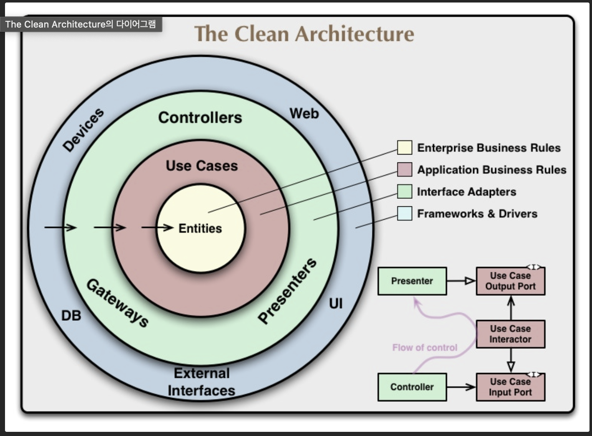

## 🎯 핵심 키워드

<aside>
💡 주요 내용들을 정리하고, 여러분만의 생각을 통해 정리해보세요!

- 레퍼런스를 참고하여 정의, 속성, 장단점 등을 적어주셔도 괜찮습니다.
- 조사는 공식 홈페이지 **Best**, 블로그(최신 날짜) **Not Bad**
</aside>

- ES
    
    ECMAScript(ES)는 JavaScript의 표준 사양으로, JavaScript, JScript, ActionScript 등의 언어들이 따르는 기반 규칙을 정의한다. 1997년 ECMA 국제기구에 의해 최초 제정되었으며, 이후 매년 버전이 업데이트되어 새로운 문법과 기능이 추가되고 있다. 주요 버전으로는 클래스, 모듈, 화살표 함수 등을 도입한 ES6(2015년), 그리고 그 이후의 async/await, 옵셔널 체이닝 등의 기능이 포함된 최신 버전들이 있다. ECMAScript는 웹 브라우저와 Node.js 환경에서의 스크립트 작성을 위한 핵심 기반으로, 현대 JavaScript 개발에 있어 표준 역할을 한다.
    
- ES6
    - ES6의 주요 변화 및 특징
        
        
        | 기능 | 설명 |
        | --- | --- |
        | `let` / `const` | 블록 스코프 변수 선언. `let`은 변경 가능, `const`는 상수. |
        | 화살표 함수 (`=>`) | 간결한 함수 표현식. `this`를 기존 문맥과 공유함. |
        | 템플릿 리터럴 | 백틱(```)을 사용한 문자열 보간 `${}` 지원. |
        | 디스트럭처링 할당 | 배열이나 객체의 값을 변수로 간편하게 추출. |
        | 클래스 (`class`) | 전통적인 객체 지향 프로그래밍 스타일 도입. |
        | 모듈 (`import` / `export`) | 파일 간 코드 분리와 재사용을 위한 모듈 시스템. |
        | Promise | 비동기 처리에 대한 표준화된 방식 도입. |
        | 기본 매개변수 | 함수의 매개변수에 기본값 설정 가능. |
        | Rest / Spread 연산자 (`...`) | 나머지 인자 수집, 배열/객체 확장 등 다양한 용도로 사용. |
        | `for...of` 반복문 | 배열 등의 iterable 객체 순회에 적합한 반복문. |
    - ES6를 중요시 하는 이유
        - **현대 JavaScript의 기초**
            
            ES6는 이후 모든 JavaScript 개발의 기반이 되는 핵심 문법과 기능들을 도입
            
            → 이후 나온 JS 문법과 프레임워크 대부분이 ES6 기준으로 만들어짐
            
        - **코드 가독성과 유지보수 향상**
            
            `let`, `const`, 화살표 함수, 템플릿 리터럴 등의 도입으로 코드가 훨씬 명확하고 간결하게 작성될 수 있음
            
            → 변수 스코프 명확하고, 문자열 처리나 함수 표현도 더 깔끔해짐
            
        - **비동기 처리 표준화**
            
            `Promise`가 도입되어 콜백 중첩 문제를 해결하고, 비동기 처리 더 쉽게 구성 가능
            
            → 콜백 지옥 탈출 가능해지고, 비동기 흐름 가독성 좋아짐
            
        - **모듈화 시스템 도입**
            
            `import` / `export` 구문을 통해 코드의 구조화를 돕고 재사용이 용이
            
            → 파일 단위 코드 분리가 쉬워져서 협업 및 유지보수에 유리함
            
        - **클래스 기반 객체지향 프로그래밍 지원**
            
            기존 prototype 기반보다 더 직관적인 방식으로 클래스와 상속을 표현할 수 있게 되었으며, 객체지향에 익숙한 개발자들이 쉽게 접근 가능
            
            → 클래스 문법 덕분에 Java, C# 쓰던 개발자들도 적응 쉬워짐
            
- ES Module
    
    ### ✅ ES Module (ESM)
    
    - ES6에서 도입된 공식 모듈 시스템
    - 파일 단위로 코드를 분리하고 재사용 가능
    - `import` / `export` 키워드 사용
    
    ---
    
    ### [주요 특징]
    
    - **정적 구조**
        
        → import/export가 파일 최상단에서 정적으로 정의
        
        → 번들러나 분석 도구가 의존성 파악하기 쉬움
        
    - **파일 단위 스코프**
        
        → 모듈마다 독립된 스코프 가짐
        
        → 글로벌 오염 없이 모듈 간 격리 가능함
        
    - **지연 로딩 가능**
        
        → `import()`를 사용해 동적으로 모듈 불러올 수 있음 (코드 스플리팅 가능)
        
    
    ---
    
    ### [기본 문법]
    
    ```jsx
    // 내보내기
    export const name = 'chatgpt';
    export function sayHi() { ... }
    
    // 불러오기
    import { name, sayHi } from './module.js';
    ```
    
    ---
    
    ### [사용 시 주의사항]
    
    - 브라우저에서는 `<script type="module">`로 사용해야 함
    - 모듈 파일은 기본적으로 strict mode로 실행됨
    - 같은 모듈은 한 번만 로드됨 (싱글턴처럼 동작함)
    
    ---
    
- 프로젝트 아키텍처
    - 프로젝트 아키텍처가 중요한 이유
        - 프로젝트 규모가 커질수록 구조화의 필요성이 커짐
            
            → 구조 없이 진행할 경우 유지보수 및 확장성에 한계 발생
            
        - 역할 분리를 통해 코드의 책임을 명확히 할 수 있음
            
            → 디버깅, 기능 추가, 수정 작업이 쉬워짐
            
        - 협업 시 코드 스타일과 설계에 일관성을 부여함
            
            → 신규 인원이 프로젝트 구조를 빠르게 이해하고 적응 가능
            
        - 테스트 및 자동화 환경 구성에 유리함
            
            → 기능 단위 테스트 작성이 쉬워지고 안정적인 개발 가능
            
        - 리팩토링 시 영향 범위 파악이 쉬워져 수정 안정성 확보
            
            → 구조화된 설계 덕분에 유지보수 부담 감소
            
        - 장기적인 생산성과 품질을 확보할 수 있는 기반 제공
            
            → 초기 설계 비용은 들지만, 시간이 지날수록 효율성 증가
            
    - Service-Oriented Architecture(Service Layer Pattern)
        - **비즈니스 로직을 독립된 서비스 계층(Service Layer)으로 분리하는 구조**
            
            → 컨트롤러(또는 UI)와 도메인/데이터 계층 사이에 위치함
            
        - **비즈니스 로직의 재사용성과 일관성 확보 가능**
            
            → 여러 컨트롤러나 클라이언트가 동일한 서비스 로직을 공유함
            
        - **역할이 명확한 계층 구조 형성**
            
            → 컨트롤러는 요청 처리와 응답만 담당, 실제 처리는 서비스가 담당
            
        - **유지보수 및 테스트 용이**
            
            → 서비스 계층 단위로 테스트 가능, 변경 사항의 영향 범위 축소
            
        - **트랜잭션 관리에 유리**
            
            → 여러 도메인 작업을 하나의 서비스에서 묶어 처리 가능
            
        - **도메인 모델과 데이터 접근 로직(repository 등)과의 의존도 조절 가능**
            
            → 느슨한 결합(Loosely Coupled)을 실현
            
    - MVC 패턴
        
        ### MVC 패턴 (**(Model-View-Controller)**
        
        > 어플리케이션을 세 가지 역할로 분리하여 유지보수와 확장성을 높이는 아키텍처 패턴
        > 
        
        ---
        
        ### [Model]
        
        - 데이터와 비즈니스 로직을 담당
        - DB와 직접 연결되어 데이터를 조회하거나 수정함
        - 뷰나 컨트롤러에 직접적으로 의존하지 않음
        
        ---
        
        ### [View]
        
        - 사용자에게 보여지는 UI를 담당
        - 모델로부터 전달받은 데이터를 화면에 렌더링
        - 사용자 입력은 직접 처리하지 않고, 컨트롤러에 전달함
        
        ---
        
        ### [Controller]
        
        - 사용자 입력을 받아서 처리 흐름을 결정
        - 모델을 조작하거나, 모델에서 데이터를 가져와 뷰에 전달함
        - 모델과 뷰 사이의 중재자 역할
        
        ---
        
        ### [흐름 요약]
        
        [사용자 입력]
        ↓
        Controller (입력 처리)
        ↓
        Model (데이터 처리)
        ↓
        View (결과 렌더링)
        
        ---
        
    - 그 외 다른 프로젝트 구조
        
        ### 1. **MVVM (Model-View-ViewModel)**
        
        > 주로 프론트엔드에서 사용됨 (예: Angular, Vue.js)
        > 
        - **Model**: 데이터와 비즈니스 로직을 담당
        - **View**: 사용자 인터페이스
        - **ViewModel**: View와 Model 사이를 연결하며 데이터 바인딩 관리
        - 양방향 데이터 바인딩을 통해 View와 Model 간 동기화
        
        ---
        
        ### 2. **Layered Architecture (계층형 아키텍처)**
        
        > 전통적인 백엔드 애플리케이션에서 많이 사용됨
        > 
        - 각 레이어가 명확한 책임을 가짐
            
            ex) Presentation Layer → Service Layer → Repository Layer → DB
            
        - 코드 분리가 명확해 유지보수와 테스트 용이
        - Spring, Django 등 주요 프레임워크에서 기본적으로 채택
        
        ---
        
        ### 3. **Hexagonal Architecture (Ports and Adapters)**
        
        > 외부 의존성을 분리하고 내부 도메인 로직을 보호하는 구조
        > 
        - 내부(Core) 도메인은 외부 기술(웹, DB, 메시지 등)에 의존하지 않음
        - **Port**는 내부와 외부 간 계약을 정의, **Adapter**는 실제 구현
        - 유연성과 테스트 용이성이 뛰어남
        - 클린 아키텍처와 개념적으로 유사
        
        ---
        
        ### 4. **Clean Architecture**
        
        > 의존성 역전을 통해 핵심 도메인 로직 보호
        > 
        - **Entities → Use Cases → Interface Adapters → Frameworks & Drivers** 순의 계층 구성
        - 안쪽 계층은 바깥 계층에 의존하지 않음 (방향이 반대)
        - 유지보수, 확장성, 테스트 용이성 모두 우수
        - 대규모 애플리케이션에서 유용
        
        ---
        
        ### 5. **Microservices Architecture (MSA)**
        
        > 하나의 앱을 여러 개의 독립적인 작은 서비스로 분할
        > 
        - 각 서비스가 독립적으로 배포되고 확장됨
        - 서비스 간 통신은 보통 HTTP API 또는 메시징 사용
        - 서비스 단위 장애 격리가 가능하지만, 인프라와 운영 복잡도는 증가
        
        ---
        
- 비즈니스 로직
    
    ### ✅ 비즈니스 로직 (Business Logic)
    
    - 애플리케이션이 해결하려는 **도메인(업무) 문제를 처리하는 핵심 로직**
    - 단순한 데이터 처리나 UI 렌더링이 아니라, **실제 비즈니스 규칙과 흐름을 구현**함
    - 예: 결제 처리, 포인트 계산, 사용자 권한 판단, 주문 상태 변경 등
    
    ---
    
    ### [위치]
    
    - 일반적으로 **Service Layer 또는 Domain Layer**에 위치
    - Controller는 요청을 받고, Service가 비즈니스 로직을 처리, Repository는 DB만 담당
    
    ---
    
    ### [중요한 이유]
    
    - **애플리케이션의 가치를 직접적으로 정의**하는 부분
    - 잘 정리된 비즈니스 로직은 유지보수가 쉽고, 요구사항 변경 대응이 빠름
    - UI나 DB가 바뀌어도 로직이 잘 분리돼 있으면 핵심 기능은 그대로 유지 가능
    
    ---
    
- DTO
    
    ### ✅ DTO (Data Transfer Object)
    
    - **계층 간 데이터 전달을 위해 사용하는 객체**
    - 주로 **Controller ↔ Service**, **Service ↔ Client** 사이에서 사용됨
    - Entity 객체를 그대로 전달하지 않고, 필요한 데이터만 추려서 전달
    
    ---
    
    ### [사용 목적]
    
    - **불필요한 데이터 노출 방지**
        
        → 예: 비밀번호, 내부 식별자 등 민감 정보 제외 가능
        
    - **API 요청/응답 형식 통제**
        
        → 프론트엔드와의 계약을 명확하게 유지
        
    - **유효성 검사(Validation) 처리 용이**
        
        → DTO에 데코레이터나 조건을 걸어 입력값 검증 가능 (예: class-validator)
        
    
    ---
    
    ### [예시]
    
    (Node.js + Express + TypeScript)
    
    ```tsx
    // CreateUserDto.ts
    export class CreateUserDto {
      email: string;
      name: string;
      password: string;
    }
    ```
    
    ```tsx
    // Controller 예시
    app.post('/users', (req, res) => {
      const dto = new CreateUserDto(req.body);
      userService.createUser(dto);
      res.status(201).send();
    });
    ```
    
    ---
    
    ### [주의사항]
    
    - **Entity와 DTO는 명확히 분리해서 사용**
        
        → Entity는 DB와 관련된 구조, DTO는 전달 목적의 구조
        
    - **지나친 중복 선언을 피하기 위해 Mapper 또는 Transformer 사용** 고려
    
    ---

## 🔥 미션   

### 🧙‍♂️ 시니어 미션

- ECMAScript의 의미, 그리고 ES6 이후에는 각 버전에 따라 어떤 기능들이 새로 추가되었는지 찾고 정리해주세요.
    - ECMAScript란?
        
        ### ✅ ECMAScript (ES)
        
        - JavaScript의 **표준 사양**
        - ECMA 국제기구의 **ECMA-262** 문서를 통해 정의됨
        - JavaScript, JScript, ActionScript 등의 기반이 되는 언어 명세
        - 문법, 타입, 객체, 함수, 표준 API 등을 명확히 규정
        - 브라우저와 실행 환경이 JavaScript를 구현할 수 있도록 기준을 제공
    - ES6 이후 버전별 주요 추가 기능
        
        ### ES7 (2016)
        
        - 지수 연산자 (`*`)
        - `Array.prototype.includes()`
        
        ---
        
        ### ES8 (2017)
        
        - `async` / `await`
        - `Object.entries()`, `Object.values()`
        - `String.prototype.padStart()`, `padEnd()`
        - `Object.getOwnPropertyDescriptors()`
        
        ---
        
        ### ES9 (2018)
        
        - 객체에 대한 Rest/Spread 문법 지원
        - `for await...of` (비동기 이터러블 처리)
        - 정규표현식 개선 (lookbehind, named capture group 등)
        - `Promise.prototype.finally()`
        
        ---
        
        ### ES10 (2019)
        
        - `Array.prototype.flat()`, `flatMap()`
        - `Object.fromEntries()`
        - `String.prototype.trimStart()`, `trimEnd()`
        - 선택적 catch 바인딩 (`catch {}`)
        - `Symbol.prototype.description`
        
        ---
        
        ### ES11 (2020)
        
        - Null 병합 연산자 (`??`)
        - 옵셔널 체이닝 (`?.`)
        - `Promise.allSettled()`
        - `globalThis` (모든 환경에서 사용 가능한 전역 객체)
        - `BigInt` 타입 (정수 범위 초과 지원)
        
        ---
        
        ### ES12 (2021)
        
        - 논리 할당 연산자 (`&&=`, `||=`, `??=`)
        - `String.prototype.replaceAll()`
        - `Promise.any()`
        - WeakRef, FinalizationRegistry (GC 관련 제어 기능)
        
        ---
        
        ### ES13 (2022)
        
        - `at()` 메서드 (배열/문자열 인덱싱 개선)
        - `Object.hasOwn()` (Object.prototype.hasOwnProperty 대체)
        - 최상위 await 지원 (모듈 최상단에서 await 사용 가능)
        - 클래스 필드/메서드 개선 (static block 등)
        
        ---
        
        ### ES14 (2023)
        
        - 정규표현식 `v` 플래그 도입 (정규식에 주석, 명명된 그룹 등 추가 기능)
        - Symbol 키 지원 강화
        - 배열/객체 리터럴 문법 개선
        
        ---
        
- 워크북에서 소개한 프로젝트 아키텍처(Controller, Service, Data Access) 구조에 대해 더 정리하고, Data Access(DB) 레이어와의 결합도를 낮출 수 있는 구조를 고민해주세요.
    - 프로젝트 아키텍처
        
        ### 1. Controller Layer
        
        - 사용자 요청을 받는 **입구** 역할
        - 요청을 **Service Layer로 전달**하고, 결과를 받아 **응답 생성**
        - 비즈니스 로직이나 데이터 처리는 하지 않음
        
        ---
        
        ### 2. Service Layer
        
        - **비즈니스 로직** 담당
        - 데이터 검증, 도메인 규칙 처리, 트랜잭션 관리 등을 수행
        - 필요한 경우 Repository에 데이터 요청
        
        ---
        
        ### 3. Data Access Layer (Repository / DAO)
        
        - 실제 **DB와의 연결을 담당**
        - Service에서 요청한 데이터를 조회하거나 저장
        - Sequelize, Prisma, TypeORM 같은 ORM 사용 가능
        
        ---
        
    - Data Access(DB) 레이어와의 결합도를 낮출 수 있는 구조
        
        ### [문제점]
        
        - Service가 Prisma 등 **특정 ORM에 직접 의존**하면, 나중에 DB 또는 ORM이 변경될 때 **서비스 로직도 수정해야 함**
        - 테스트 시에도 실제 DB 없이 테스트하기 어려움
        
        ---
        
        ### [해결방안]
        
        1.  Repository 인터페이스 정의
        2. 구현체에서 실제 ORM 사용
        3. Service에서 인터페이스 의존
        
        ---
        
- 클린 아키텍처(Clean Architecture)와 의존성(Dependency)의 방향에 대해서도 찾아본 후 정리해주세요.
    - 클린 아키텍처란?
        
        ### ✅ 클린 아키텍처(Clean Architecture)
        
        > 소프트웨어 시스템을 계층화하여 각 계층의 책임을 명확히 하고, 의존성의 방향을 제어하여 시스템의 유연성과 유지보수성을 높이는 설계 원칙
        이 아키텍처의 핵심은 **의존성 규칙(Dependency Rule)**으로, 소스 코드의 의존성이 반드시 안쪽 계층(고수준 정책)을 향하도록 설계
        > 
        
        ---
        
        ### [계층 구조]
        
        
        
        1. **Entities**
            - 시스템의 핵심 도메인 규칙
            - 변경에 가장 강한 계층 (프레임워크나 UI 변경과 무관해야 함)
        2. **Use Cases**
            - 애플리케이션의 구체적인 동작 흐름 정의
            - 비즈니스 요구사항을 구현 (예: 회원 가입, 주문 처리 등)
        3. **Interface Adapters**
            - 외부 요청/응답 데이터를 내부 포맷으로 변환 (ex. Controller, Presenter, Repository 구현체 등)
            - 유스케이스 계층과 외부 기술 간 중간 다리 역할
        4. **Frameworks & Drivers**
            - 웹 프레임워크, 데이터베이스, 외부 API 등 실제 기술 구현
            - 가장 바깥 계층이며, 교체 가능한 구조로 설계
            
        
        ---
        
    - 의존성
        
        ### 1. 의존성 방향 원칙 (Dependency Rule)
        
        - *안쪽 계층(Entities, Use Cases)**은 **바깥 계층(Frameworks, DB 등)에 의존하지 않음**
        - 바깥 계층이 안쪽 계층의 인터페이스에 의존함
        - 고수준 비즈니스 로직이 저수준 구현에 영향을 받지 않도록 설계
        
        ---
        
        ### 2. 의존성 역전 원칙 (Dependency Inversion Principle)
        
        - 고수준 모듈과 저수준 모듈 모두 **추상화(인터페이스)**에 의존
        - 예: UseCase가 직접 DB를 의존하지 않고 `UserRepository` 인터페이스에 의존
        - 실제 구현은 외부(예: Prisma, Mongo 등)에서 제공
        
        ---
        
        ### 3. 의존성 주입 (Dependency Injection)
        
        - 필요한 객체(예: 저장소, 서비스 등)를 외부에서 주입함으로써 결합도 낮춤
        - 예: 생성자 주입, 팩토리 주입 방식 사용
        - 테스트 시 가짜(mock) 구현체를 주입해 단위 테스트 가능
        
        ---
        

## 💪 미션 기록

<aside>
🍀 미션 기록의 경우, 아래 미션 기록 토글 속에 작성하시거나, 페이지를 새로 생성하여 해당 페이지에 기록하여도 좋습니다!

하지만, 결과물만 올리는 것이 아닌, **중간 과정 모두 기록하셔야 한다는 점!** 잊지 말아주세요.

</aside>

- 미션 기록
    
    
    
    
    포인트 계산은 유도속성으로 포인트 테이블을 따로 만들지 않고 미션 컬럼의 status를 확인해 완료된 미션 데이터 이용해 따로 계산하는 로직을 구현하는 것이 나을 것 같다는 피드백 듣고 points 테이블 삭제
    
    
    
    ERD Cloud에서 제공한 sql 파일을 바탕으로 테이블 생성
    
    ERD를 설계할 때 ENUM 값을 정확히 입력해두지 않아 오류가 났음