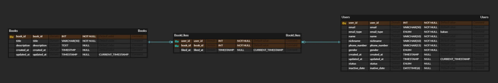
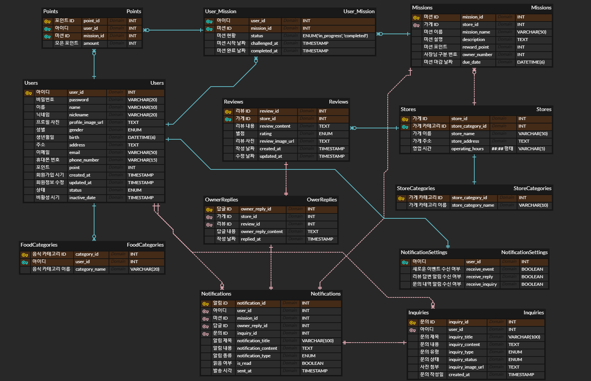

# 🎯 핵심 키워드

---

<aside>
💡 주요 내용들에 대해 조사해보고, 자신만의 생각을 통해 정리해보세요!
레퍼런스를 참고하여 정의, 속성, 장단점 등을 적어주셔도 됩니다.
조사는 공식 홈페이지 **Best**, 블로그(최신 날짜) **Not Bad**

</aside>

- 외래키
    - FK란?
        
        ### ✅ **FK(**Foreign Key, **왜래키)**
        
        > `FK(왜래키)`는 Foreign Key의 약자로 다른 테이블의 `PK(기본키)`를 참조하는 값
        > 
        > 
        > **테이블 간 관계 설정, 데이터 무결성을 유지하는 역할**
        > 
        
        ---
        
        ### **[FK의 특징]**
        
        - 다른 테이블의 `PK`를 참조하는 값
        - 두 테이블을 연결하여 관계 설정 (1:1, 1:N, N:M 관계 가능)
        - 데이터 무결성 유지 → 부모 테이블(`PK`가 있는 테이블)에 존재하지 않는 값은 `FK`에 저장할 수 없음
        - 참조된 데이터가 변경되면 `FK` 값도 영향을 받을 수 있음
        - `FK`를 표시할 때에는 선을 이어주며, 개체와 관계를 따져 표시함
        
        ---
        
        ### **[FK의 역할]**
        
        - 테이블 간 관계 설정
        - 데이터 무결성 유지 (잘못된 데이터 삽입 방지)
        - 부모 데이터가 변경될 때 자동으로 자식 데이터 유지 가능 (`CASCADE`)
        
        ---
        
        ### **[FK의 단점]**
        
        - 삽입 속도 저하 (무결성 검사로 인해)
        - 대량 데이터 삭제 시 성능 이슈 발생 가능 (`CASCADE` 적용 시)
        - `FK`가 많을 경우 테이블 변경(ALTER) 시 제약 발생 가능
        
        ---
        
    - FK 제약 조건
        
        ### **[FK 기본 문법]**
        
        ```sql
        [CONSTRAINT [이름]] FOREIGN KEY
            [인덱스_이름] (컬럼_이름, ...)
            REFERENCES 참조할_테이블 (컬럼_이름,...)
            [ON DELETE 옵션]
            [ON UPDATE 옵션]
        ```
        
        - `CONSTRAINT` → 외래 키 제약 조건의 이름 (생략 가능)
        - `REFERENCES` → 참조할 부모 테이블 및 컬럼
        - `ON DELETE` → 부모 테이블 데이터가 삭제될 때 동작
        - `ON UPDATE` → 부모 테이블 데이터가 변경될 때 동작
        
        ---
        
        ### **[ON DELETE & ON UPDATE 옵션]**
        
        | 옵션 | 설명 |
        | --- | --- |
        | **CASCADE** | 부모 테이블의 데이터가 삭제되거나 변경되면, 자식 테이블의 FK 값도 자동으로 삭제 또는 변경됨 |
        | **SET NULL** | 부모 테이블의 데이터가 삭제되거나 변경되면, 자식 테이블의 FK 값을 `NULL`로 설정함. (자식 테이블의 FK 컬럼이 `NULL`을 허용해야 사용 가능) |
        | **RESTRICT** | 부모 테이블의 데이터를 삭제 또는 변경할 수 없음 (자식 테이블에서 FK가 참조 중이면 삭제/변경 거부됨) |
        | **NO ACTION** | `RESTRICT`와 동일하지만, 일부 DB에서는 트랜잭션 커밋 시점까지 FK 제약 검사를 연기할 수 있음 |
        | **SET DEFAULT** | 부모 데이터가 삭제되거나 변경될 때, 자식 테이블의 FK 컬럼을 기본값(DEFAULT)으로 변경함 **(MySQL에서는 지원되지 않음)** |
        
        ---
        
        ### **[FK 사용 예시]**
        
        ```sql
        CREATE TABLE Rent (
            rent_id INT PRIMARY KEY AUTO_INCREMENT,
            user_id INT NOT NULL,
            FOREIGN KEY (user_id) REFERENCES Users(user_id) ON DELETE CASCADE
        );
        ```
        
        - `Rent.user_id`가 `Users.user_id`(PK)를 참조 → FK 설정
        - `ON DELETE CASCADE` → 부모(`Users`) 데이터 삭제 시 자식(`Rent`) 데이터도 삭제됨
        
        ---
        
        ### **[FK 옵션을 명시하지 않을 경우 ]**
        
        - **(`ON DELETE`, `ON UPDATE` 생략 시 기본값)**
        - SQL 표준에서는 `NO ACTION`이 기본값으로 설정됨
        - **하지만 MySQL에서는 `RESTRICT`가 기본값으로 적용됨**
        - 즉, `ON DELETE` 또는 `ON UPDATE`를 명시하지 않으면 **부모 테이블의 데이터를 삭제하거나 변경할 수 없음**
        
        - 예제 (FK 옵션 미설정 시)
            
            ```sql
            CREATE TABLE Rent (
                rent_id INT PRIMARY KEY AUTO_INCREMENT,
                user_id INT NOT NULL,
                FOREIGN KEY (user_id) REFERENCES Users(user_id)  -- ON DELETE, ON UPDATE 옵션 없음
            );
            ```
            
            - 이 경우 **MySQL에서는 기본적으로 `RESTRICT`가 적용됨** → `Users` 테이블에서 `user_id` 삭제 시 오류 발생
        
        ---
        
        ### [FK 옵션을 `CASCADE`로 변경하는 방법]
        
        > 만약 FK가 기본값(`RESTRICT`)으로 생성되어 부모 테이블의 데이터 삭제가 불가능할 경우, **`CASCADE`로 변경해야 함**
        > 
        
        **1️⃣ 기존 FK 삭제**
        
        ```sql
        ALTER TABLE Rent DROP FOREIGN KEY fk_user;
        ```
        
        **2️⃣ 새로운 FK 추가 (`ON DELETE CASCADE` 적용)**
        
        ```sql
        ALTER TABLE Rent
        ADD CONSTRAINT fk_user
        FOREIGN KEY (user_id) REFERENCES Users(user_id) ON DELETE CASCADE;
        ```
        
        - 이제 `Users` 테이블에서 `user_id`가 삭제되면 `Rent` 테이블에서도 해당 대여 기록이 자동으로 삭제됨
        
        ---
        
        ### [FK 제약 조건 설정 시 주의사항]
        
        1. **부모 테이블과 자식 테이블의 저장 엔진이 동일해야 함** 
            - `InnoDB`만 지원, `MyISAM`에서는 불가능
        2. **FK를 참조하는 컬럼과 참조되는 컬럼의 데이터 타입이 일치해야 함** 
            - ex) `INT` → `INT`
        3. **`BLOB` 또는 `TEXT` 타입 컬럼에는 FK 설정 불가능**
            - MySQL에서 전체 컬럼을 인덱스로 설정할 수 없음
        4. **FK가 설정된 테이블의 저장 엔진을 변경할 수 없음**
            - 변경하려면 FK를 먼저 삭제해야 함
        5. **FK를 참조하는 인덱스가 있어야 함**
            - MySQL이 자동으로 생성하지만, 삭제될 수도 있음
        
        ---
        
    - InnoDB, MyISAM
        
        
    - FK 관련 질문
        
        ### **1️⃣ FK는 무조건 PK를 참조해야 하나?**
        
        - FK는 **PK 또는 `UNIQUE` 제약이 걸린 컬럼을 참조해야 함**
        - 일반 컬럼을 참조하는 FK는 설정할 수 없음
        
        ---
        
        ### **2️⃣** **FK는 무조건 PK가 되는가?**
        
        - **NO!**
        - FK는 부모 테이블의 `PK` 또는`UNIQUE` 컬럼을 참조할 수 있으며, **자식 테이블에서 독립적인 PK를 가질 수도 있음**
        
        ---
        
- 기본키
    - PK란?
        
        ### ✅ PK **(**Primary Key, **기본키)**
        
        > `PK(기본키)`는 Primary Key의 약자로, 테이블에서 각 행(Row)을 유일하게 식별하는 값
        > 
        > 
        > **데이터의 무결성 유지, 중복을 방지하는 역할**
        > 
        
        ---
        
        ### **[PK의 특징]**
        
        - 각 행을 유일하게 식별하는 값
        - NULL 값을 허용하지 않음 (`NOT NULL`)
        - 중복 값을 허용하지 않음 (`UNIQUE`)
        - 한 테이블에는 하나의 `PK`만 존재 가능 (단, `복합 PK` 사용 가능)
        - 자동으로 클러스터형 인덱스(Clustered Index)가 생성됨
        - 다른 테이블의 `FK`로 참조될 수 있음
        
        ---
        
        ### **[PK의 역할]**
        
        - 각 행을 고유하게 구분
        - 데이터 무결성 유지 (중복/`NULL`방지)
        - 인덱스를 자동 생성하여 검색 성능 향상
        - `FK`를 통해 다른 테이블에서 참조 가능
        
        ---
        
        ### **[PK의 단점]**
        
        - `PK` 변경 시 `FK`를 가진 테이블도 영향을 받을 수 있음
        - `복합 PK` 사용 시 조회 성능이 다소 떨어질 수 있음
        
        ---
        
    - PK 제약 조건
        
        ### **[PK 기본 문법]**
        
        ```sql
        [CONSTRAINT [이름]] PRIMARY KEY (컬럼_이름, ...);
        ```
        
        - `CONSTRAINT` → 기본키 제약 조건의 이름 (생략 가능)
        - `PRIMARY KEY` → 기본키로 설정할 컬럼
        
        ---
        
        ### **[PK의 종류]**
        
        **1️⃣ 단일 PK (Single Primary Key)**
        
        - 한 개의 컬럼이 PK 역할 수행
            
            ```sql
            CREATE TABLE Users (
                user_id INT PRIMARY KEY AUTO_INCREMENT,
                name VARCHAR(50) NOT NULL
            );
            ```
            
            - `user_id`가 **각 사용자를 유일하게 식별하는 PK 역할**을 함.
        
        **2️⃣ 복합 PK (Composite Primary Key)**
        
        - 두 개 이상의 컬럼이 결합하여 PK 역할 수행
            
            ```sql
            CREATE TABLE OrderDetail (
                order_id INT,
                detail_id INT,
                PRIMARY KEY (order_id, detail_id)  -- 복합 PK
            );
            ```
            
            - **`order_id + detail_id` 조합이 유일한 값이 됨**
        
        ---
        
        ### **[PK 사용 예시]**
        
        ```sql
        CREATE TABLE Books (
            book_id INT PRIMARY KEY AUTO_INCREMENT,
            title VARCHAR(255) NOT NULL
        );
        ```
        
        - `Books.book_id`가 **각 책을 유일하게 식별하는 기본키**
        - `AUTO_INCREMENT`를 사용하여 자동 증가 설정 가능
        
        ---
        
        ### **[PK 설정 시 주의사항]**
        
        1. **한 테이블에 하나의 PK만 존재 가능** (단, 복합 PK는 예외)
        2. **PK 컬럼은 반드시 `NOT NULL`, `UNIQUE` 제약 조건을 가짐**
        3. **`BLOB` 또는 `TEXT` 타입 컬럼에는 PK 설정 불가능**
            - MySQL에서 전체 컬럼을 인덱스로 설정할 수 없음
        4. **PK는 자동으로 클러스터형 인덱스로 설정됨**
        5. **PK가 설정된 테이블의 구조를 변경하려면 FK 관계를 먼저 삭제해야 함**
        
        ---
        
    - PK 관련 질문
        
        ### **1️⃣ PK가 없을 수도 있나?**
        
        - 모든 테이블에는 일반적으로 **PK가 있어야 함** (없으면 데이터 무결성이 깨질 가능성이 높음).
        - 하지만 **특정한 경우(임시 테이블 등)에는 PK 없이 사용될 수도 있음.**
        
        ---
        
        ### **2️⃣ PK가 있으면 무조건 비식별 관계인가?**
        
        - **NO!**
            - 부모 테이블의 PK가 자식 테이블의 PK에도 포함되면 → **식별 관계 (Identifying Relationship)**
            - 부모 테이블의 PK가 포함되지 않고 FK로만 존재하면 → **비식별 관계 (Non-Identifying Relationship)**
        
        ---
        
- ER 다이어그램
    - ERD란?
        
        ### **✅ ERD (Entity-Relationship Diagram,** 개체-관계 다이어그램)
        
        > 단어에서 의미하는 그대로 **Entity(개체)**와 **Relationship(관계)**를 중점적으로 표시하는 데이터베이스 구조를 한 눈에 알아보기 위해 그려놓는 다이어그램
        > 
        
        ---
        
        ### [ERD 설계 이유]
        
        1. 테이블의 구조를 시각적으로 한 눈에 볼 수 있게 해주기 때문에 이해를 높여주고 프로젝트 요구사항에 맞게 개발하는데 용이함
        2. 관계와 관계간의 정보를 나타냄으로써 어떤 테이블 구조로 만들었는지 알 수 있음
        3. `create`문을 자동으로 생성해주기 때문에 따로 작성하지 않아도 됨
        
        ---
        
    - ERD 구성 요소
        
        ### **Entity (개체)**
        
        > Entity는 **데이터베이스에서 관리하고자 하는 주요 대상(개체, 개념, 사물)**을 의미
        > 
        - 쉽게 말해 **데이터를 저장하는 테이블**의 개념
        - 하나 이상의 속성(Attribute)을 가져야 함
        - 다른 개체와 관계(Relationship)를 가질 수 있음
        - 데이터베이스 내에서 **독립적으로 존재 가능해야 함**
        - 모든 엔티티는 유일하게 **식별될 수 있어야 함** (즉, PK가 필요함)
        
        ---
        
        ### **Attribute (속성)**
        
        > Attribute는 **개체(Entity)가 가지고 있는 정보(컬럼, 속성 값)**를 의미
        > 
        - 각 엔티티는 **하나 이상의 속성**을 가짐
        - 각 속성은 특**정 데이터 타입(`INT`, `VARCHAR` 등)**을 반드시 명시해야 함
        - 하나의 컬럼에는 **하나의 데이터만 포함해야 하며, 리스트나 여러 값을 넣으면 안 됨**
        
        ---
        
        ### Relationship (관계)
        
        > Relationship은 **개체(Entity) 간의 연관성**을 나타내는 요소
        > 
        - 두 개 이상의 엔티티 사이에서 형성됨
        - 관계가 **식별 관계(Identifying)인지, 비식별 관계(Non-Identifying)인지** 고려해야 함
        
        ---
        
- 복합 키
    - 복합키란?
        
        ### ✅ 복합키 (Composite Key)
        
        > 복합키는 **두 개 이상의 컬럼을 결합하여 하나의 `PK`로 사용**하는 것을 의미
        > 
        > 
        > 즉, **단일 컬럼만으로 유일한 식별이 불가능할 때, 여러 개의 컬럼을 조합하여 유일성을 보장하는 키**
        > 
        
        ---
        
        ### [복합키 특징]
        
        - 보통 N:M(다대다) 관계를 해결하는 **교차 테이블(Join Table)**에서 자주 사용됨
        - 관계형 DB에서 **데이터 무결성(Integrity)을 유지**하는 데 도움을 줌
        - 일부 DB에서는 복합키를 설정하면 **자동으로 인덱스를 생성**함 (MySQL의 경우 인덱스 자동 생성)
        
        ---
        
    - 예제
        
        <aside>
        🗯️
        
        > 실습에서 진행한 책 대여 앱 ERD 설계를 예로 들어 복합키 사용에 대해 알아보자
        > 
        </aside>
        
        ### **[복합키가 필요한 이유]**
        
        - **문제 상황**
            - 한 명의 사용자가 여러 권의 책을 대여할 수 있음 (**1:N 관계**)
            - 한 권의 책도 여러 사용자가 대여할 수 있음 (**N:1 관계**)
            - 즉, `Users(사용자)`와 `Books(책)` 사이에는 **N:M 관계**가 존재함
            - **N:M 관계를 해결하기 위해 Rent(대여 기록) 테이블을 생성해야 함**
            - 사용자가 같은 책을 여러 번 빌릴 경우, **대여 기록이 중복되지 않도록 해야 함**
        - **해결 방법**
            - `Rent(대여 기록)` 테이블을 생성하여 **N:M 관계를 해결**
            - `Rent` 테이블에서 **어떤 사용자가 어떤 책을 빌렸는지를 유일하게 식별하기 위해 복합 키 사용**
            - 즉, `user_id + book_id` 조합을 **복합키**로 설정하여 중복 대여 방지
        
        ---
        
        ### **[복합키 적용 예제]**
        
        ```sql
        CREATE TABLE Users (
            user_id INT PRIMARY KEY AUTO_INCREMENT,  -- 사용자 PK
            name VARCHAR(50) NOT NULL,
            email VARCHAR(100) UNIQUE
        );
        
        CREATE TABLE Books (
            book_id INT PRIMARY KEY AUTO_INCREMENT,  -- 책 PK
            title VARCHAR(255) NOT NULL,
            author VARCHAR(100) NOT NULL
        );
        
        CREATE TABLE Rent (
            user_id INT NOT NULL,  -- 대여한 사용자 ID
            book_id INT NOT NULL,  -- 대여한 책 ID
            rent_date DATE NOT NULL,  -- 대여일
            return_date DATE,  -- 반납 예정일
            PRIMARY KEY (user_id, book_id),  -- 복합 키 설정
            FOREIGN KEY (user_id) REFERENCES Users(user_id) ON DELETE CASCADE,
            FOREIGN KEY (book_id) REFERENCES Books(book_id) ON DELETE CASCADE
        );
        ```
        
        - `Rent` 테이블에서 `user_id + book_id`를 **복합키**로 설정
        - 동일한 사용자가 같은 책을 여러 번 대여하는 것을 **방지**
        - 부모 테이블(`Users`, `Books`)이 삭제되면 연관된 `Rent` 데이터도 **자동 삭제 (`ON DELETE CASCADE` 적용)**
        
        ---
        
- 연관관계
    - 종류
        
        ### 1:1 관계 (One-to-One)
        
        > 보통 추가적인 상세 정보를 저장하는 테이블에서 사용됨
        > 
        > 
        > FK를 어느 테이블에 둘 것인지 결정해야 함
        > 
        
        
        
        - 한명의 학생은 하나의 신체정보를 갖기 때문에 1:1로 매칭
        
        ---
        
        ### 1:N 관계 (One-to-Many)
        
        > 가장 일반적인 관계 유형
        > 
        
        
        
        - 한명의 학생은 하나의 취미를 가지거나 여러개를 가지거나 아예 없을 수 있음
        
        ---
        
        ### N:M 관계 (Many-to-Many)
        
        > **N:M 관계는 직접 설정할 수 없으며, 연결 테이블(Join Table)**을 사용하여 해결해야 함
        > 
        > 
        > 연결 테이블에서 **두 개의 FK를 복합키(Composite Key)로 설정**하는 것이 일반적
        > 
        
        
        
        - `Books`와 `Users`는 N:M 관계
        - `BookLikes` 테이블을 중간 테이블로 두어 **1:N, N:1 관계로 변환**
        
        ---
        
    - 식별관계와 비식별관계
        
        ### **식별 관계 (Identifying) VS 비식별 관계 (Non-Identifying)**
        
        | 관계 유형 | 설명 | PK 구성 |
        | --- | --- | --- |
        | **식별 관계 (Identifying)** | 부모의 PK가 자식의 PK에도 포함됨 | PK + FK |
        | **비식별 관계 
        (Non-Identifying)** | 부모의 PK가 자식의 FK로만 존재 | PK & FK 분리 |
- 정규화
    
    [정보처리 실기_데이터베이스06강_정규화](https://youtu.be/RXQ1kZ_JHqg?si=f0OPsoOWnJXSbqca)
    
    ### ✅ **정규화 (Normalization)**
    
    > 데이터베이스 설계 시 데이터의 중복을 줄이고, 무결성을 유지하며, 저장 효율성을 높이기 위해 데이터를 구조화하는 과정
    > 
    > 
    > 즉, **데이터를 논리적으로 정리하여 "불필요한 중복을 최소화"**하고, **"데이터 무결성을 보장"**하는 방법
    > 
    
    ---
    
    ### **[정규화의 필요성]**
    
    1. **데이터 중복 제거** → **저장 공간 절약**
    2. **데이터 무결성(Integrity) 유지** → **수정·삭제 시 일관성 보장**
    3. **데이터 삽입·수정·삭제 시 이상(Anomaly) 방지**
    4. **데이터베이스의 성능 최적화**
    5. **데이터 관계를 명확하게 정의하여 확장성 확보**
    
    ---
    
- 반 정규화
    - 반정규화란?
        
        ### ✅ **반정규화(Denormalization)**
        
        > DB의 성능을 최적화하기 위해 정규화된 데이터 구조를 일부러 역설계(중복 허용, 테이블 병합 등)하는 과정
        > 
        > 
        > 즉, **JOIN 연산을 줄이고, 데이터 조회 속도를 향상시키기 위해 정규화를 일부 해제하는 방법**
        > 
        
        ---
        
        ### **[반정규화의 필요성]**
        
        1. **데이터 조회 속도 향상** → JOIN 연산이 많아질 경우 성능 저하 방지
        2. **복잡한 쿼리 최적화** → JOIN을 줄여 간단한 SELECT만으로도 데이터 조회 가능
        3. **트랜잭션 성능 개선** → 많은 테이블을 동시에 변경하는 복잡한 트랜잭션을 줄일 수 있음
        4. **다량의 데이터 처리 성능 향상** → 분석(OLAP) 시스템에서는 빠른 데이터 조회가 중요
        
        ---
        
    - 반정규화 기법
        
        <aside>
        🗯️
        
        > 반정규화는 주로 **테이블 구조 변경**, **중복 데이터 허용**, **데이터 중복 저장** 등의 방법으로 진행됨
        > 
        </aside>
        
        ### **테이블 병합 (테이블 조인 제거)**
        
        > 정규화된 두 개의 테이블을 하나로 합쳐 JOIN을 줄이는 방법
        > 
        > 
        > 조회 성능은 향상되지만, 중복 데이터가 증가하여 데이터 변경이 어려워질 수 있음
        > 
        
        - **정규화된 설계 (JOIN 필요)**
            
            ```sql
            CREATE TABLE Users (
                user_id INT PRIMARY KEY,
                name VARCHAR(50)
            );
            
            CREATE TABLE UserDetails (
                user_id INT PRIMARY KEY,
                address VARCHAR(100),
                phone VARCHAR(20),
                FOREIGN KEY (user_id) REFERENCES Users(user_id)
            );
            ```
            
            - JOIN을 해야 사용자 정보 + 상세 정보를 조회할 수 있음
        
        - **반정규화 적용 (테이블 병합)**
            
            ```sql
            CREATE TABLE Users (
                user_id INT PRIMARY KEY,
                name VARCHAR(50),
                address VARCHAR(100),
                phone VARCHAR(20) -- 테이블 병합
            );
            ```
            
            - JOIN 없이 단일 테이블 조회 가능 → 조회 성능 향상
            - 하지만 중복된 데이터가 증가할 수 있음
        
        ---
        
        ### **중복 데이터 저장 (컬럼 추가)**
        
        > 다른 테이블에서 가져와야 할 데이터를 현재 테이블에 중복 저장하여 JOIN을 줄이는 방법
        > 
        > 
        > 조회 속도는 빨라지지만, 데이터의 일관성을 유지하기 어려울 수 있음
        > 
        
        - **정규화된 설계 (JOIN 필요)**
            
            ```sql
            CREATE TABLE Orders (
                order_id INT PRIMARY KEY,
                user_id INT,
                product_id INT,
                FOREIGN KEY (user_id) REFERENCES Users(user_id),
                FOREIGN KEY (product_id) REFERENCES Products(product_id)
            );
            ```
            
            - `Orders` 테이블에서 `product_id`만 저장 → 제품명을 조회하려면 `Products` 테이블과 JOIN 해야 함
        
        - **반정규화 적용 (중복 데이터 저장)**
            
            ```sql
            CREATE TABLE Orders (
                order_id INT PRIMARY KEY,
                user_id INT,
                product_id INT,
                product_name VARCHAR(255) NOT NULL, -- 제품명 중복 저장
                FOREIGN KEY (user_id) REFERENCES Users(user_id)
            );
            ```
            
            - `product_name`을 `Orders` 테이블에 중복 저장하여 **JOIN 없이 바로 조회 가능**
            - 제품명이 변경될 경우 **`Orders` 테이블에서도 업데이트 필요** → 데이터 일관성 문제 발생 가능
        
        ---
        
        ### **계산된 컬럼 추가 (중복 저장)**
        
        > 자주 사용하는 데이터를 미리 계산하여 컬럼으로 저장
        > 
        > 
        > e.g. 합계, 카운트, 평균 값 등을 미리 저장하여 성능 향상
        > 
        
        - **정규화된 설계**
            
            ```sql
            CREATE TABLE Orders (
                order_id INT PRIMARY KEY,
                user_id INT,
                total_price DECIMAL(10,2) -- 주문 합계를 실시간으로 계산
            );
            ```
            
            - `total_price`는 주문 상세 테이블에서 SUM을 이용해 계산해야 함 → 성능 저하 가능
        
        - **반정규화 적용 (계산된 값 저장)**
            
            ```sql
            CREATE TABLE Orders (
                order_id INT PRIMARY KEY,
                user_id INT,
                total_price DECIMAL(10,2) NOT NULL -- 주문 합계 미리 저장
            );
            ```
            
            - `total_price`를 미리 계산하여 저장하면 조회 속도 향상
            - 하지만 주문 변경 시 **`total_price` 값을 업데이트해야 하는 문제 발생**
        
        ---
        
        ### **데이터 중복 테이블 추가 (조회 성능 개선)**
        
        > 자주 조회되는 데이터를 위한 별도 테이블을 만들어 조회 성능을 최적화
        > 
        > 
        > e. g. 통계 테이블, 캐시 테이블 등
        > 
        
        - **정규화된 설계 (실시간 계산)**
            
            ```sql
            SELECT COUNT(*) FROM Orders WHERE order_date = CURDATE();
            ```
            
            - **매번 COUNT 연산을 수행해야 하므로 성능 저하 발생**
        
        - **반정규화 적용 (집계 테이블 추가)**
            
            ```sql
            CREATE TABLE OrderStats (
                stat_date DATE PRIMARY KEY,
                total_orders INT NOT NULL
            );
            ```
            
            - `OrderStats` 테이블을 미리 생성하여 **주문 수를 저장하고 빠르게 조회**
            - **하지만 새로운 주문이 들어오면 통계 값을 업데이트해야 함**
        
        ---
        

## 📢 학습 후기

---

- 이번 주차 워크북을 해결해보면서 어땠는지 회고해봅시다.
- 핵심 키워드에 대해 완벽하게 이해했는지? 혹시 이해가 안 되는 부분은 뭐였는지?

<aside>
💡 ERD 설계 과정에서 양쪽의 테이블 중 어디가 어디를 참조하는지 구분하는 것이 아직 헷갈린다. 연관관계에 대한 연습과 공부가 더 필요할 것 같다.

</aside>

## ⚠️ 스터디 진행 방법

---

1. 스터디를 진행하기 전, 워크북 내용들을 모두 채우고 스터디에서는 서로 모르는 내용들을 공유해주세요.
2. 미션은 워크북 내용들을 모두 완료하고 나서 스터디 전/후로 진행해보세요.
3. 다음주 스터디를 진행하기 전, 지난주 미션을 서로 공유해서 상호 피드백을 진행하시면 됩니다.

## ✅ 실습 체크리스트

---

- [x]  DATABASE 설계
- [x]  로컬 DB 세팅

## ☑️ 실습 인증

---

- [x]  ERD 설계

.png)

- [x]  DB 접속


## 🔥 미션

---

- **미션 자료**
    
    <aside>
    🚨 ❗**해당 자료는 챌린저분들의 미션을 위해 Plan 파트에서 제공해준 자료로,
    미션 외의 용도로 사용하는 것 및 유출을 절대 금합니다.**❗
    
    **❗아래 IA&WF 사진 및 for_UMC.fig 파일 및 파일 속 내용의 저작권은 모두 5th UMC Plan 파트장 아크(박승민)에게 있음을 밝힙니다.❗**
    
    </aside>
    
    - IA&WF 사진 파일
        
        아래 사진 외에도 첨부드린 사진에 해당하는 피그마 파일이 존재하니
        사진을 통해 보기 어려우시다면 피그마 파일을 이용해주세요!
        
        
        
        IA
        
        
        
        WF
        
    
    [for_UMC.fig](for_UMC.fig)
    
1. 주어진 IA(기획 플로우)와 와이어 프레임(디자인 프로토타입)을 보고 직접 데이터베이스를 설계해오기, 위에서 언급한 경우를 다 적용해서 할 것
2. 이름 글자 수 등 세부적인 부분은 원하는 대로 해도 됨!
3. 각 지역 별로 가게들이 있으며 가게를 방문하는 미션을 해결하며 포인트를 모으는 서비스
    1. 모든 지역마다 10개의 미션 클리어시 1000 point 부여로 고정

**최소한 로그인/회원가입, 미션, 홈 화면에 필요한 데이터는 설계를 해야함, 되어있지 않다면 원 아웃**

***미션 난이도 완화를 위해 지도 검색 기능 전부 pass, 저 부분은 설계 하지 마세요***

***내 포인트 관리, 알 부분도 설계하지 마세요***

***사장님이 자신의 점포 관리하는 부분도 설계 대상에서 제외입니다.***

물론 원하시면 하셔도 됩니다. 😉

**< 시니어 미션 >**

[시니어 미션](%E1%84%89%E1%85%B5%E1%84%82%E1%85%B5%E1%84%8B%E1%85%A5%20%E1%84%86%E1%85%B5%E1%84%89%E1%85%A7%E1%86%AB%201b7b57f4596b81628b49d5e6b4345dbd.md)

## 💪 미션 기록

---

<aside>
🍀 미션 기록의 경우, 아래 미션 기록 토글 속에 작성하시거나, 페이지를 새로 생성하여 해당 페이지에 기록하여도 좋습니다!

하지만, 결과물만 올리는 것이 아닌, **중간 과정 모두 기록하셔야 한다는 점!** 잊지 말아주세요.

</aside>

- **미션 기록**
    
    ERD 설계
    
    
    
    ✅ “미션 10개 달성 시 1,000P”와 같은 **누적 보상 로직**은 ERD에 별도로 컬럼을 만들지 않고, `User_Mission`테이블에서**`status = 'completed'`인 row 수를 세어 처리**
    

## ⚡ 트러블 슈팅

---

<aside>
💡 실습하면서 생긴 문제들에 대해서, **이슈 - 문제 - 해결** 순서로 작성해주세요.

</aside>

<aside>
💡 스스로 해결하기 어렵다면? 스터디원들에게 도움을 요청하거나 **너디너리의 지식IN 채널에 질문**해보세요!

</aside>

- ⚡이슈 작성 예시 (이슈가 생기면 아래를 복사해서 No.1, No.2, No3 … 으로 작성해서 트러블 슈팅을 꼭 해보세요!)
    
    **`이슈`**
    
    👉 앱 실행 중에 노래 다음 버튼을 누르니까 앱이 종료되었다.
    
    **`문제`**
    
    👉 노래클래스의 데이터리스트의 Size를 넘어서 NullPointException이 발생하여 앱이 종료된 것이었다. 
    
    **`해결`**
    
    👉  노래 다음 버튼을 눌렀을 때 데이터리스트의 Size를 검사해 Size보다 넘어가려고 하면 다음으로 넘어가는 메서드를 실행시키지 않고, 첫 노래로 돌아가게끔 해결
    
    **`참고레퍼런스`**
    
    - 링크
- ⚡이슈 No.1
    
    **`이슈`**
    
    👉 [트러블이 생긴 상태 작성]
    
    **`문제`**
    
    👉 [어떤 이유로 해당 이슈가 일어났는지 작성]
    
    **`해결`**
    
    👉  [해결 방법 작성]
    
    **`참고레퍼런스`**
    
    - [문제 해결 시 참고한 링크]

## 🤔 참고 자료

[1주차](1%E1%84%8C%E1%85%AE%E1%84%8E%E1%85%A1%201b7b57f4596b81f5ad9bdcae889a5abe.csv)

---

Copyright © 2023 최용욱(똘이) All rights reserved.

Copyright © 2024, 2025 김준환(제이미) All rights reserved.